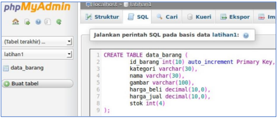
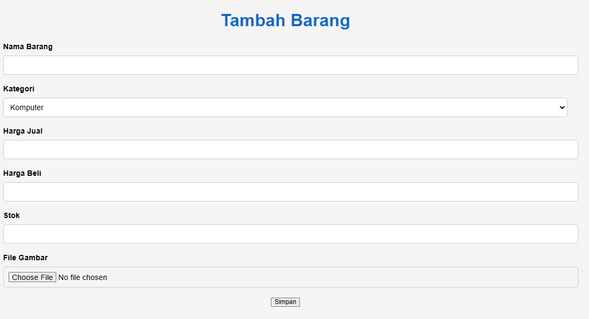

<body>
    <table border="1">
        <tr>
            <th> Nama</th>
            <th>NIM</th>
            <th>Kelas</th>
        </tr>
        <tr>
            <td>Ahmad Syukron</td>
            <td>312110056</td>
            <td>TI.21.A.1</td>
        </tr>
    </table>
</body>

# Tugas Pratikum 03
## Hasil

## Step Pembuatan

### Membuat Database
```bash
CREATE DATABASE latihan1;
```

### Membuat Tabel
```bash
CREATE TABLE data_barang (
 id_barang int(10) auto_increment Primary Key,
 kategori varchar(30),
 nama varchar(30),
 gambar varchar(100),
 harga_beli decimal(10,0),
 harga_jual decimal(10,0),
 stok int(4)
);
```


### Menambahkan Data
```bash
INSERT INTO data_barang (kategori, nama, gambar, harga_beli, harga_jual, 
stok)
VALUES ('Elektronik', 'HP Samsung Android', 'hp_samsung.jpg', 2000000, 
2400000, 5),
('Elektronik', 'HP Xiaomi Android', 'hp_xiaomi.jpg', 1000000, 1400000, 5),
('Elektronik', 'HP OPPO Android', 'hp_oppo.jpg', 1800000, 2300000, 5);
```


### Membuat file koneksi database
- Buat file baru dengan nama <b>koneksi.php</b><p>
```bash
<?php
$host = "localhost";
$user = "root";
$pass = "";
$db = "latihan1";
$conn = mysqli_connect($host, $user, $pass, $db);
if ($conn == false)
{
 echo "Koneksi ke server gagal.";
 die();
} #else echo "Koneksi berhasil";
?>
```

### Membuat file index untuk menampilkan data (Read)
- Buat file baru dengan nama <b>index.php</b><p>
```bash
<?php
include_once("koneksi.php");
// query untuk menampilkan data
$sql = 'SELECT * FROM data_barang';
$result = mysqli_query($conn, $sql);
?>
<!DOCTYPE html>
<html lang="en">
<head>
    <meta charset="UTF-8">
    <link href="style.css" rel="stylesheet" type="text/css" />
    <title>Data Barang</title>
</head>
<body>
    <div class="container">
        <h1>Data Barang</h1>
        <div class="main">
            <table>
            <a href="tambah.php">Tambah Data</a>
                <tr>
                    <th>Gambar</th>
                    <th>Nama Barang</th>
                    <th>Kategori</th>
                    <th>Harga Jual</th>
                    <th>Harga Beli</th>
                    <th>Stok</th>
                    <th>Aksi</th>
                </tr>
                <?php if ($result) : ?>
                    <?php while ($row = mysqli_fetch_array($result)) : ?>
                        <tr>
                            <td>" alt="<?= $row['nama']; ?>"></td>
                            <td><?= $row['nama']; ?></td>
                            <td><?= $row['kategori']; ?></td>
                            <td><?= $row['harga_jual']; ?></td>
                            <td><?= $row['harga_beli']; ?></td>
                            <td><?= $row['stok']; ?></td>
                            <td>
                                <a href="ubah.php?id=<?= $row['id_barang']; ?>">Ubah</a> |
                                <a href="hapus.php?id=<?= $row['id_barang']; ?>" onclick="return confirm('Anda yakin akan menghapus data ini?')">Hapus</a>
                            </td>
                        </tr>
                    <?php endwhile;
                else : ?>
                    <tr>
                        <td colspan="7">Belum ada data</td>
                    </tr>
                <?php endif; ?>
            </table>
        </div>
    </div>
</body>
</html>
```
- Hasil<p>


### Menambah Data (Create)
- Buat file baru dengan nama <b>tambah.php</b><p>
```bash
<?php
error_reporting(E_ALL);
include_once 'koneksi.php';
if (isset($_POST['submit'])) {
    $nama = $_POST['nama'];
    $kategori = $_POST['kategori'];
    $harga_jual = $_POST['harga_jual'];
    $harga_beli = $_POST['harga_beli'];
    $stok = $_POST['stok'];
    $file_gambar = $_FILES['file_gambar'];
    $gambar = null;
    if ($file_gambar['error'] == 0) {
        $filename = str_replace(' ', '_', $file_gambar['name']);
        $destination = dirname(__FILE__) . '/gambar/' . $filename;
        if (move_uploaded_file($file_gambar['tmp_name'], $destination)) {
            $gambar = 'gambar/' . $filename;;
        }
    }
    $sql = 'INSERT INTO data_barang (nama, kategori,harga_jual, harga_beli, 
stok, gambar) ';
    $sql .= "VALUE ('{$nama}', '{$kategori}','{$harga_jual}', 
'{$harga_beli}', '{$stok}', '{$gambar}')";
    $result = mysqli_query($conn, $sql);
    header('location: index.php');
}
?>
<!DOCTYPE html>
<html lang="en">

<head>
    <meta charset="UTF-8">
    <link href="style.css" rel="stylesheet" type="text/css" />
    <title>Tambah Barang</title>
</head>

<body>
    <div class="container">
        <h1>Tambah Barang</h1>
        <div class="main">
            <form method="post" action="tambah.php" enctype="multipart/form-data">
                <div class="input">
                    <label>Nama Barang</label>
                    <input type="text" name="nama" />
                </div>
                <div class="input">
                    <label>Kategori</label>
                    <select name="kategori">
                        <option value="Komputer">Komputer</option>
                        <option value="Elektronik">Elektronik</option>
                        <option value="Hand Phone">Hand Phone</option>
                    </select>
                </div>
                <div class="input">
                    <label>Harga Jual</label>
                    <input type="text" name="harga_jual" />
                </div>
                <div class="input">
                    <label>Harga Beli</label>
                    <input type="text" name="harga_beli" />
                </div>
                <div class="input">
                    <label>Stok</label>
                    <input type="text" name="stok" />
                </div>
                <div class="input">
                    <label>File Gambar</label>
                    <input type="file" name="file_gambar" />
                </div>
                <div class="submit">
                    <input type="submit" name="submit" value="Simpan" />
                </div>
            </form>
        </div>
    </div>
</body>

</html>
```
- Hasil<p>



### Mengubah Data (Update)
- Buat file baru dengan nama <b>ubah.php</b><p>
```bash
<?php
error_reporting(E_ALL);
include_once 'koneksi.php';
if (isset($_POST['submit'])) {
    $id = $_POST['id'];
    $nama = $_POST['nama'];
    $kategori = $_POST['kategori'];
    $harga_jual = $_POST['harga_jual'];
    $harga_beli = $_POST['harga_beli'];
    $stok = $_POST['stok'];
    $file_gambar = $_FILES['file_gambar'];
    $gambar = null;

    if ($file_gambar['error'] == 0) {
        $filename = str_replace(' ', '_', $file_gambar['name']);
        $destination = dirname(__FILE__) . '/gambar/' . $filename;
        if (move_uploaded_file($file_gambar['tmp_name'], $destination)) {
            $gambar = 'gambar/' . $filename;;
        }
    }
    $sql = 'UPDATE data_barang SET ';
    $sql .= "nama = '{$nama}', kategori = '{$kategori}', ";
    $sql .= "harga_jual = '{$harga_jual}', harga_beli = '{$harga_beli}', 
   stok = '{$stok}' ";
    if (!empty($gambar))
        $sql .= ", gambar = '{$gambar}' ";
    $sql .= "WHERE id_barang = '{$id}'";
    $result = mysqli_query($conn, $sql);
    header('location: index.php');
}
$id = $_GET['id'];
$sql = "SELECT * FROM data_barang WHERE id_barang = '{$id}'";
$result = mysqli_query($conn, $sql);
if (!$result) die('Error: Data tidak tersedia');
$data = mysqli_fetch_array($result);
function is_select($var, $val)
{
    if ($var == $val) return 'selected="selected"';
    return false;
}
?>
<!DOCTYPE html>
<html lang="en">

<head>
    <meta charset="UTF-8">
    <link href="style.css" rel="stylesheet" type="text/css" />
    <title>Ubah Barang</title>
</head>

<body>
    <div class="container">
        <h1>Ubah Barang</h1>
        <div class="main">
            <form method="post" action="ubah.php" enctype="multipart/form-data">
                <div class="input">
                    <label>Nama Barang</label>
                    <input type="text" name="nama" value="<?php echo
                                                            $data['nama']; ?>" />
                </div>
                <div class="input">
                    <label>Kategori</label>
                    <select name="kategori">
                        <option <?php echo is_select('Komputer', $data['kategori']); ?> value="Komputer">Komputer</option>
                        <option <?php echo is_select('Komputer', $data['kategori']); ?> value="Elektronik">Elektronik</option>
                        <option <?php echo is_select('Komputer', $data['kategori']); ?> value="Hand Phone">Hand Phone</option>
                    </select>
                </div>
                <div class="input">
                    <label>Harga Jual</label>
                    <input type="text" name="harga_jual" value="<?php echo $data['harga_jual']; ?>" />
                </div>
                <div class="input">
                    <label>Harga Beli</label>
                    <input type="text" name="harga_beli" value="<?php echo $data['harga_beli']; ?>" />
                </div>
                <div class="input">
                    <label>Stok</label>
                    <input type="text" name="stok" value="<?php echo $data['stok']; ?>" />
                </div>
                <div class="input">
                    <label>File Gambar</label>
                    <input type="file" name="file_gambar" />
                </div>
                <div class="submit">
                    <input type="hidden" name="id" value="<?php echo $data['id_barang']; ?>" />
                    <input type="submit" name="submit" value="Simpan" />
                </div>
            </form>
        </div>
    </div>
</body>

</html>
```
- Hasil<p>


### Menghapus Data (Delete)
- Buat file baru dengan nama <b>hapus.php</b><p>
```bash
<?php
include_once 'koneksi.php';
$id = $_GET['id'];
$sql = "DELETE FROM data_barang WHERE id_barang = '{$id}'";
$result = mysqli_query($conn, $sql);
header('location: index.php');
?>
```

### Memperbagus tampilan
- Buat file baru dengan nama <b>style.css</b><p>
```bash
/* Styling untuk body */
body {
    margin: 0;
    padding: 0;
    font-family: Arial, sans-serif;
    background-color: #f5f5f5;
  }
  
  /* Styling untuk container */
  .container {
    width: 80%;
    margin: 0 auto;
    text-align: center;
  }
  
  /* Styling untuk judul */
  h1 {
    margin-top: 50px;
    font-size: 36px;
    font-weight: bold;
    color: #0f6bc2;
  }
  
  /* Styling untuk tabel */
  table {
    width: 100%;
    border-collapse: collapse;
    margin-top: 30px;
  }
  
  table th, table td {
    padding: 15px;
    text-align: center;
    border: 1px solid #ccc;
  }
  
  table th {
    background-color: #0f6bc2;
    color: #fff;
  }
  
  /* Styling untuk link tambah data */
  a {
    display: inline-block;
    padding: 10px 20px;
    background-color: #0f6bc2;
    color: #fff;
    text-decoration: none;
    margin-top: 20px;
    margin-bottom: 20px;
    border-radius: 5px;
  }
  
  a:hover {
    background-color: #0f6bc2;
  }
  
  /* Styling untuk form input */
  .input {
    margin-bottom: 20px;
    text-align: left;
  }
  
  .input label {
    display: block;
    margin-bottom: 5px;
    font-weight: bold;
  }
  
  .input input, .input select {
    width: 100%;
    padding: 10px;
    border: 1px solid #ccc;
    border-radius: 5px;
    font-size: 16px;
    margin-top: 5px;
  }
  
  .input input:focus, .input select:focus {
    outline: none;
    border: 1px solid #0f6bc2;
  }
  
  /* Styling untuk tombol simpan dan reset */
  .btn {
    margin-top: 20px;
  }
  
  .btn button {
    padding: 10px 20px;
    background-color: #0f6bc2;
    color: #fff;
    border: none;
    border-radius: 5px;
    cursor: pointer;
    margin-right: 10px;
  }
  
  .btn button:hover {
    background-color: #0f6bc2;
  }
  
  /* Styling untuk gambar */
  img {
    max-width: 150px;
    height: auto;
    margin: 0 auto;
    display: block;
    margin-top: 10px;
    margin-bottom: 10px;
  }
```


# END
